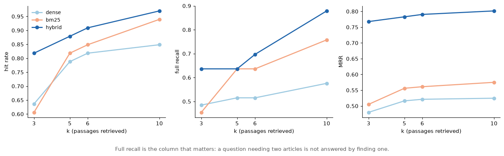
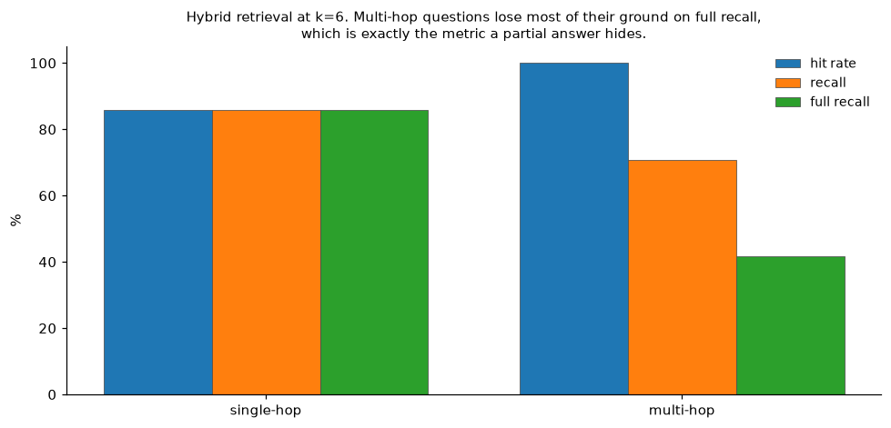
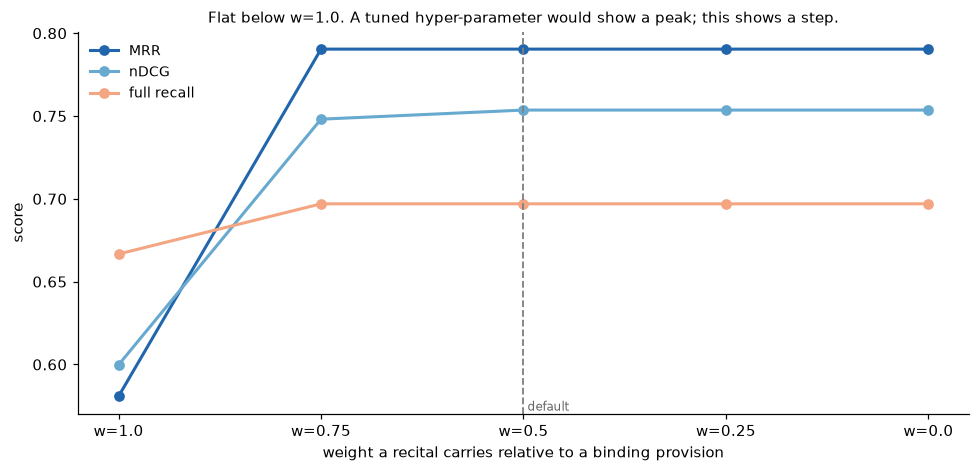
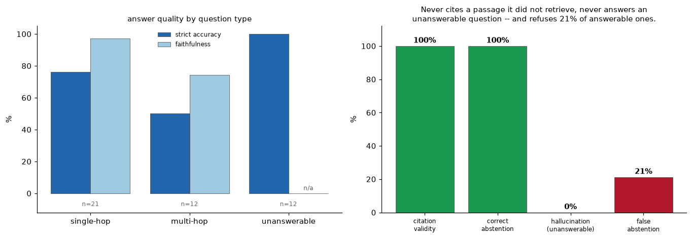
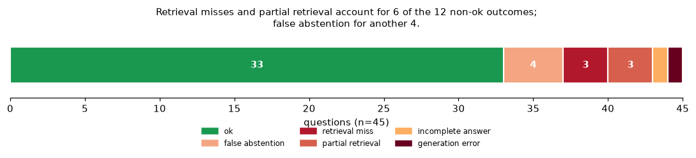

# EU AI Act RAG — with an evaluation I actually ran

**[▶ Live demo](https://eu-ai-act-rag-eval.streamlit.app/)** · every
answer shows the passages it came from.

[](https://github.com/aghasalim/eu-ai-act-rag/actions/workflows/ci.yml)
[](https://github.com/aghasalim/eu-ai-act-rag/actions/workflows/demo.yml)
[](https://github.com/aghasalim/eu-ai-act-rag/actions/workflows/publish-image.yml)
[](https://www.python.org/)
[](LICENSE)

A question-answering system over **Regulation (EU) 2024/1689 (the EU AI Act)**, built
by a third-year Applied Computer Science (AI) student.

I started this because I kept seeing RAG projects — including my own earlier attempts —
that stop at "look, it answers questions." Nobody checks whether the answer is actually
in the documents it retrieved. So I made the measurement the main part of the project
and the chatbot the side effect. I wrote 45 test questions by hand, scored the system
against them, and wrote down where it fails.

The short version: the retrieval is decent (90.9% of questions get at least one correct
provision), and genuinely bad at one specific thing (questions that need two articles at
once — only 41.7% of those get everything they need). I'd rather show you that number
than hide it.

---


---

## Abstract

Retrieval-augmented question answering over regulatory text is easy to demo and
hard to evaluate: an answer that reads well can cite the wrong article, and a
system that never refuses will confidently answer questions the corpus cannot
support. This work builds grounded QA over Regulation (EU) 2024/1689 with an
evaluation designed before the system, on 45 hand-written questions spanning
single-hop, multi-hop and deliberately out-of-scope cases.

Hybrid retrieval by reciprocal rank fusion reaches 90.9% hit rate and 69.7% full
recall at k=6, against 81.8%/51.5% for dense and 84.9%/63.6% for BM25 — and full
recall is the column that matters, because a question needing two articles is not
answered by finding one. Down-weighting recitals, the non-binding "whereas"
paragraphs that match a plain-English question better than the terse article
containing the rule, lifts MRR from 0.581 to 0.790. That gain is a step rather
than a peak: every weight below 1.0 scores identically, so it is structural rather
than a hyper-parameter fitted to 45 questions.

On generation the system cites only passages it retrieved (citation validity
1.00) and refuses all 12 unanswerable questions, so the hallucination rate on
out-of-scope input is zero. It pays for that with a 21% false-abstention rate on
answerable questions, which is the honest cost of a conservative refusal policy
and is reported rather than tuned away.

**Contributions.** (i) An evaluation set with unanswerable questions built in, so
refusal is measured rather than assumed. (ii) A recital-weighting ablation
distinguishing a structural gain from a fitted one. (iii) A failure taxonomy
attributing every non-ok outcome to retrieval, abstention or generation. (iv) A
report pipeline that regenerates both RESULTS.md and the README table from one
artefact, so no number in this repository is typed by hand.

---

## 1. Results

### 1.1 Retrieval



Hybrid is not uniformly better: BM25 leads dense on full recall at every k, and
the fusion is what buys the gap over both. Full recall is the column that decides
whether a multi-hop answer can be complete.



Multi-hop questions lose most of their ground on full recall specifically, which
is the failure a partial answer conceals: the model has one of the two articles it
needs and writes a fluent answer from it.

45 hand-written questions over 464 chunks. Retrieval scoring needs no LLM at all, so
anyone can reproduce these numbers for free. Full breakdown in
**[RESULTS.md](RESULTS.md)**.

### Retrieval, k=6

<!-- RETRIEVAL_TABLE:START -->
| strategy | hit rate | recall | full recall | MRR | nDCG | s/query |
|---|---|---|---|---|---|---|
| dense (bge-small) | 81.8% | 67.2% | 51.5% | 0.521 | 0.537 | 0.369 |
| BM25 | 84.9% | 73.2% | 63.6% | 0.561 | 0.571 | 0.002 |
| **hybrid (RRF)** | **90.9%** | **80.3%** | **69.7%** | **0.790** | **0.754** | 0.019 |
<!-- RETRIEVAL_TABLE:END -->

"Hit rate" means at least one required article showed up. "Full recall" means *all* of
them did. That second column is the one I care about, because a question needing two
articles can't be answered properly if you only found one.

### Three things I did not expect

**Keyword search beat embeddings.** I assumed dense retrieval would win easily. It
didn't. Legal text runs on exact phrases like "serious incident", "putting into service"
and "Annex III", and a 384-dimensional vector smooths over exactly those distinctions.
BM25 beat dense on almost every metric. Hybrid wins because the two methods miss
different questions, not because dense is carrying it.

**Multi-hop questions are where it falls apart.**

| strategy | multi-hop hit rate | multi-hop **full** recall |
|---|---|---|
| dense | 91.7% | 8.3% |
| BM25 | 91.7% | 33.3% |
| hybrid | 100.0% | 41.7% |

Hybrid finds something relevant for every single multi-hop question, and finds
everything it needs for under half of them. If I had only reported average recall, this
would have been invisible. This is the case that produces answers which sound complete
but quietly drop the exception or the deadline.

**The recitals were sabotaging retrieval.** The Act has 180 recitals — the "whereas"
paragraphs at the top. They explain the rules in normal flowing sentences, which means
they look *more* like an answer to a plain-English question than the actual article
does. They were pushing real articles out of the top results. Giving them less weight
in the ranking moved MRR from 0.581 to 0.790.

I checked whether I was just fitting a number to my own test set, and I don't think so:
every weight below 1.0 gives an identical score, so it's a step rather than a peak
([the sweep is in RESULTS.md](RESULTS.md#ablation-down-weighting-recitals)). It's doing
something structural — pushing non-binding text below binding text. I kept the weight at
0.5 instead of 0 because it scores the same and still lets recitals be retrieved when
they're genuinely useful. Caveat I should state: none of my 45 questions have a recital
as the correct answer, so this measurement flatters the change.

### Answer quality, faithfulness and hallucination

Answered by `openai/gpt-oss-20b`, graded by `qwen/qwen3.6-27b` — a different model
family, so it isn't marking its own work. **All 45 questions.**

| metric | value |
|---|---|
| **Faithfulness** (claims entailed by retrieved text) | **90.2%** |
| **Citation validity** (citations pointing at retrieved passages) | **100%** |
| **Correct abstention** on out-of-scope questions | **100%** (12/12) |
| **Hallucination rate** on out-of-scope questions | **0%** |
| Answer accuracy, strict | 66.7% |
| Answer accuracy, incl. partially correct | 69.7% |
| False abstention (refused a question it could answer) | 21.2% |

Broken out:

| type | n | accuracy | faithfulness |
|---|---|---|---|
| single-hop | 21 | 76.2% | 97.2% |
| **multi-hop** | 12 | **50.0%** | 74.3% |
| unanswerable | 12 | 100% | — |

**A measurement bug was costing me 12 points of accuracy, and it hit the hardest
questions hardest.** `LLM_MAX_TOKENS` was 800. On a reasoning model that cap is a
*shared* budget — the `<think>` block is billed against it before any content is
emitted — so a question that reasons for 800 tokens returns an **empty string**, with
no error and a ~60s latency. Four answers came back empty. All four were multi-hop,
because those reason longest. Raising the cap to 2500:

| | 800-token cap | 2500-token cap |
|---|---|---|
| accuracy, strict | 54.5% | **66.7%** |
| **multi-hop accuracy** | **25.0%** | **50.0%** |
| answers returned empty | 4 | 0 |

Multi-hop accuracy **doubled**. I had written up 25% as a retrieval story — the system
finds one of the two articles and answers half the question. That story was partly
true and partly my own truncation, and I could not tell the difference until the empty
answers were gone. It is a good argument for looking at raw model output rather than
only at aggregate metrics: an empty string scores identically to a wrong answer, and
nothing in the summary distinguishes them.

Multi-hop is still the weak half at 50% against single-hop's 76%, and it still tracks
multi-hop retrieval full-recall (41.7%). Faithfulness on multi-hop *fell* (82.7% →
74.3%) once the answers were no longer truncated, which makes sense: a longer answer
makes more claims, and more claims means more chances for one to be unsupported.

The refusal behaviour is the strongest result here: **12 out of 12 out-of-scope
questions refused, none hallucinated** — including ones designed to bait it, like
asking for a FLOP count when the corpus contains a similar-looking FLOP threshold. It
errs toward refusing, which is why false abstention is 21%. For a legal assistant I
would take that trade.

---

### 1.2 The recital ablation



Recitals restate the operative rules in flowing prose, so they match a
natural-language question better than the article that actually contains the rule,
and they were crowding binding provisions out of the top-k. Every weight below 1.0
scores identically. A tuned hyper-parameter would show a peak here; a structural
effect shows a step, and this is a step.

### 1.3 Generation





Six of the twelve non-ok outcomes are retrieval failures — three complete misses
and three partial — and another four are refusals of answerable questions. Only
two are generation faults given correct evidence. That split is the argument for
spending effort on retrieval rather than on prompting.

## 2. Running it

```bash
make setup && make corpus && make index
```

```bash
make eval-retrieval
```

That reproduces every number above. No API key, no LLM calls, no cost.

For actual generated answers, add a free [Groq](https://console.groq.com/keys) key:

```bash
cp .env.example .env && echo "GROQ_API_KEY=your_key_here" >> .env
```

```bash
make eval && make report && make app
```

Or just pull the container:

```bash
docker run -p 8501:8501 ghcr.io/aghasalim/eu-ai-act-rag:latest
```

---

## 3. Method

### Getting the text, and chunking it

I pull the official XHTML from the EU Publications Office Cellar API (CELEX
`32024R1689`). I originally tried scraping eur-lex.europa.eu and got a bot-challenge
page back every time — Cellar serves the same authoritative text and, more usefully,
keeps its ELI markup, so every article and annex has a stable id I can key on.

**I chunk on the document's own structure instead of a fixed token window.** The reason
is that an answer to a legal question is a citation. If someone asks about high-risk
classification, the useful reply is "Article 6(2)", so the thing I retrieve should be
the thing you'd cite. A sliding window kept cutting an article's main rule away from its
exceptions paragraph, and in this Regulation the exception is very often the actual
answer.

That created three problems I had to deal with:

| problem | what I did |
|---|---|
| Articles range from 2 lines (Art. 4) to about 9k tokens (Art. 3 has 68 definitions) | Split at numbered-item boundaries first, sentence boundaries second, never mid-sentence |
| A split chunk on its own is meaningless ("…shall not apply" — what shall not apply?) | Every chunk starts with a `Chapter > Section > Article N — Title` breadcrumb that gets embedded with it |
| The lettered lists `(a) (b) (c)` are nested two-column HTML tables, and `get_text()` turns them into mush | Wrote a recursive renderer that rebuilds the outline structure |

End result: 113 articles + 180 recitals + 13 annexes → **464 chunks**, 95th percentile
440 tokens, longest 468. All under the encoder's 512-token limit, which matters more
than it sounds: anything longer gets silently truncated when embedded, so you lose text
with no error message. There's a test that fails if this ever regresses.

Two bugs I only caught by reading the parsed output:

- The `10^25` FLOP threshold in Article 51(2) is a superscript in the source, and naive
  extraction turns it into `"10 25"`. That's the number that decides whether a model
  counts as systemic risk, so getting it wrong is not cosmetic.
- Long recitals came out as single 1000-token chunks, meaning half of each one never
  made it into the embedding.

### Retrieval

`BAAI/bge-small-en-v1.5` in Chroma, combined with BM25 using Reciprocal Rank Fusion.

I used RRF rather than blending the two scores because cosine similarity and BM25 scores
aren't on the same scale, so blending needs a scaling constant that you'd have to retune
for every corpus — and tuning it on my own test set is exactly the trap I was trying to
avoid. RRF only looks at the rank positions, so there's nothing to fit.

### Generation

Groq, OpenAI, Gemini and Ollama all speak the same OpenAI-style chat API, so the whole
LLM layer is one `httpx` call and there's no vendor SDK in `requirements.txt`. Switching
provider is two lines in `.env`.

The prompt gives the model a literal "say NOT_IN_CORPUS" escape hatch. Without one, an
instruction-tuned model will answer an out-of-scope question anyway rather than admit it
doesn't know, which is the whole reason 12 of my test questions are unanswerable. With
no key configured the app returns retrieved passages and no generated answer, instead of
making something up.

---

## 4. The test set

45 questions in [`eval/qa_set.jsonl`](eval/qa_set.jsonl). I wrote all of them by hand
against text I'd read in the parsed corpus, and each one records which articles count as
the correct answer plus a note on what failure it's meant to catch.

- **21 single-hop** — the answer is stated in one place.
- **12 multi-hop** — you need two or more articles.
- **12 unanswerable** — GDPR, the Digital Services Act, facts the Regulation simply
  never states. These aren't testing knowledge, they're testing whether the system will
  admit it doesn't know.

I deliberately went after places where being *nearly* right is still wrong:

- Article 73 has three different serious-incident deadlines depending on severity: 15
  days normally, 10 days if someone died, 2 days for a widespread infringement.
- Article 99 sets fines at "whichever is **higher**" of a cash amount or a percentage of
  turnover — then Article 99(6) flips it to "whichever is **lower**" for SMEs.
- Article 2(8) exempts research and development, and then pulls real-world testing back
  out of that exemption.

### What gets measured

| metric | needs an LLM? | catches |
|---|---|---|
| hit rate / recall / full recall / MRR / nDCG | no | wrong or incomplete passages retrieved |
| citation validity | no | the answer citing something that was never retrieved |
| faithfulness (per claim) | yes | the answer claiming more than the passages support |
| answer correctness | yes | right sources, wrong conclusion |
| abstention / hallucination rate | yes | answering when it should have refused |

Citation validity is my favourite one because it needs no judge model at all — you just
check whether each cited article was in the retrieved set. A citation pointing at
something the model never saw is a made-up citation, and that's the failure mode that
looks most like evidence.

On the LLM-graded metrics, I tried to head off the obvious objection. The judge is a
different model from the one writing the answers, and the results file records which
judge ran. Faithfulness is scored claim by claim rather than asking "is this answer
faithful?", because the second question invites a vague yes. RAGAS runs as a second
opinion if you install it (`pip install -r requirements-eval.txt`).

Failures get sorted by cause, earliest cause first, so if retrieval missed the article
then the wrong answer is counted as a retrieval problem and not blamed on the model.

---

## 5. Limitations

- **41.7% full recall on multi-hop questions.** Biggest weakness by far. Splitting the
  question into sub-queries and retrieving for each is the obvious next thing to try,
  and the harness is already set up to tell me whether it actually helped.
- **45 questions is a small test set, and I wrote them myself** for a system I also
  built. That's two sources of bias I can't fully remove alone. Small differences
  between numbers here are noise.
- **No questions where a recital is the right answer**, which makes the recital
  down-weighting look better than it probably is.
- **English only.** The Act is equally valid in 24 languages and I've tested one.
- **The generation half of the evaluation hasn't been run yet** (needs an API key).
- `data/processed/chunks.jsonl` is generated, not source. It's committed so you can look
  at the chunking without installing anything; CI rebuilds it from the raw document and
  re-tests it.
- This is a student project, not legal advice. Please don't make compliance decisions
  with it.

---

## 6. Repository layout

```
src/euactrag/    fetch → ingest (chunking) → index → retrieve → pipeline
eval/            qa_set.jsonl · metrics.py · judge.py · run_eval.py · report.py
app/             Streamlit UI, shows the answer next to its sources
tests/           corpus integrity, metric maths, citation parsing
deploy/          Hugging Face Space template
```

## 7. Docker

```bash
make docker
```

CI builds `linux/amd64` and publishes to
`ghcr.io/aghasalim/eu-ai-act-rag:latest`, then starts the image and checks retrieval
still works before letting the tag stand. The index is built into the image, so a cold
container answers immediately instead of downloading a model first.

It's a 2.8 GB image, which I'm not happy about. Most of that is `torch` (635 MB) plus
things I don't use directly but that come along with `chromadb` (onnxruntime, kubernetes)
and `streamlit` (pyarrow). Exporting the encoder to ONNX Runtime — which chromadb
installs anyway — would drop torch entirely. I haven't done it yet.

### Hosting it

Heads-up if you're following an older RAG tutorial: **Hugging Face Spaces is no longer
free for this.** Their API now rejects Docker and Gradio Spaces on free `cpu-basic` with
a 402 unless you have PRO, and the Streamlit SDK has been removed entirely — the only
free tier left is `static`, which can't run Python. I found this out by trying it.

So the options are:

| host | cost | notes |
|---|---|---|
| Streamlit Community Cloud | free | Built for exactly this. Points at this repo and `app/streamlit_app.py`. |
| Hugging Face Space (docker) | PRO, $9/mo | [`deploy/HF_SPACE_README.md`](deploy/HF_SPACE_README.md) has the config; works as soon as the account has PRO. |
| Anything that runs a container | varies | `docker run -p 8501:8501 ghcr.io/aghasalim/eu-ai-act-rag:latest` |

Whichever you pick, set `GROQ_API_KEY` as a **secret**, never as a plain environment
variable. Without it the app still runs and still shows retrieved passages, it just
won't generate prose answers.

This one is deployed on Streamlit Community Cloud:
**https://eu-ai-act-rag-eval.streamlit.app/**

The settings are:

| field | value |
|---|---|
| Repository | `aghasalim/eu-ai-act-rag` |
| Branch | `main` |
| Main file path | `app/streamlit_app.py` |
| Python version | `3.12` (also pinned in `.python-version`) |

Then under **Advanced settings → Secrets**, paste `GROQ_API_KEY = "your_key"`.

The app builds its vector index on first boot if it doesn't find one, so the first
load takes a couple of minutes and every load after that is instant. `data/index/` is
deliberately not committed: a Chroma store is a binary tied to one chromadb version and
rots silently when that version moves, whereas the chunks it's built from are plain
JSONL in the repo.

---

## 8. Credit

The corpus is Regulation (EU) 2024/1689 from the Official Journal of the European Union,
via the EU Publications Office (CELEX 32024R1689). Reuse is covered by Decision
2011/833/EU. Nothing here is affiliated with or endorsed by the EU.

The code is MIT ([LICENSE](LICENSE)). The corpus is not mine to licence, so its
attribution lives in [NOTICE](NOTICE) rather than in the licence file.
