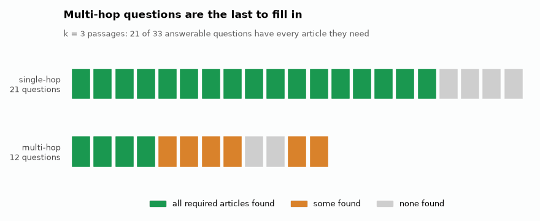

# EU AI Act RAG, with an evaluation I actually ran

**[▶ Live demo](https://eu-ai-act-rag-eval.streamlit.app/)** · every
answer shows the passages it came from.

[](https://github.com/aghasalim/eu-ai-act-rag/actions/workflows/ci.yml)
[](https://github.com/aghasalim/eu-ai-act-rag/actions/workflows/demo.yml)
[](https://github.com/aghasalim/eu-ai-act-rag/actions/workflows/publish-image.yml)
[](https://www.python.org/)
[](LICENSE)

A question-answering system over **Regulation (EU) 2024/1689 (the EU AI Act)**, built
by a third-year Applied Computer Science (AI) student. Most RAG projects, mine included,
stop at "look, it answers questions" without checking whether the answer is in the
documents retrieved. Here the measurement is the main part and the chatbot is the side
effect: 45 hand-written questions, the system scored against them, the failures written
down. The retrieval is decent (90.9% of questions get at least one
correct provision) and genuinely bad at one specific thing (questions that need two
articles at once, only 41.7% of those get everything they need). I'd rather show you
that number than hide it.

Long write-up: **[notes/METHODS.md](notes/METHODS.md)**. Per-question numbers:
**[RESULTS.md](RESULTS.md)**.

---

## Retrieval


45 hand-written questions over 464 chunks. BM25 leads dense on full recall at every k,
and the fusion is what buys the gap over both. Retrieval scoring needs no LLM, so these
numbers are free to reproduce.

### Retrieval, k=6

<!-- RETRIEVAL_TABLE:START -->
| strategy | hit rate | recall | full recall | MRR | nDCG | s/query |
|---|---|---|---|---|---|---|
| dense (bge-small) | 81.8% | 67.2% | 51.5% | 0.521 | 0.537 | 0.369 |
| BM25 | 84.9% | 73.2% | 63.6% | 0.561 | 0.571 | 0.002 |
| **hybrid (RRF)** | **90.9%** | **80.3%** | **69.7%** | **0.790** | **0.754** | 0.019 |
<!-- RETRIEVAL_TABLE:END -->

"Hit rate" means at least one required article showed up. "Full recall" means *all* of
them did, and that is the column I care about.


Multi-hop questions lose their ground on full recall: hybrid finds something relevant
for 100% of them and everything they need for 41.7%. Keyword search beating embeddings
was the other surprise, both broken down in
[notes/METHODS.md](notes/METHODS.md#three-things-i-did-not-expect).



*Each tile is one of the 33 answerable questions, coloured by how much of what
it needs hybrid retrieval has found. Only k changes across the frames, 3 then
5 then 6 then 10, and the tiles that never fill in are the multi-hop ones.*


Recitals, the non-binding "whereas" paragraphs, restate the rules in flowing prose and
were crowding binding articles out of the top-k. Down-weighting them moved MRR from
0.581 to 0.790. Every weight below 1.0 scores identically, so it is a step, not a peak
fitted to 45 questions.

## Answers

Answered by `openai/gpt-oss-20b`, graded by `qwen/qwen3.6-27b`, a different model
family, so it isn't marking its own work. **All 45 questions.**

| metric | value |
|---|---|
| **Faithfulness** (claims entailed by retrieved text) | **90.2%** |
| **Citation validity** (citations pointing at retrieved passages) | **100%** |
| **Correct abstention** on out-of-scope questions | **100%** (12/12) |
| **Hallucination rate** on out-of-scope questions | **0%** |
| Answer accuracy, strict | 66.7% |
| Answer accuracy, incl. partially correct | 69.7% |
| False abstention (refused a question it could answer) | 21.2% |


12 out of 12 out-of-scope questions refused, none hallucinated, including ones designed
to bait it. It errs toward refusing, which is why false abstention is 21%. Per-type
breakdown, and the `LLM_MAX_TOKENS` bug that was costing 12 points of accuracy, in
[notes/METHODS.md](notes/METHODS.md#answer-quality-broken-out).


Six of the twelve non-ok outcomes are retrieval failures, three complete misses and
three partial, and four more are refusals of answerable questions. Only two are
generation faults given correct evidence, which is the argument for spending effort on
retrieval rather than on prompting.

## Method, briefly

Official XHTML from the EU Publications Office Cellar API (CELEX `32024R1689`), chunked
on the document's own structure rather than a fixed window, because the answer to a
legal question is a citation: 113 articles + 180 recitals + 13 annexes → **464 chunks**,
all under the encoder's 512-token limit. Retrieval is `BAAI/bge-small-en-v1.5` in Chroma
fused with BM25 by Reciprocal Rank Fusion, which ranks by position and so has no scaling
constant to fit. Detail in [notes/METHODS.md](notes/METHODS.md#3-method), test set in
[notes/METHODS.md](notes/METHODS.md#4-the-test-set).

## Running it

```bash
make setup && make corpus && make index
make eval-retrieval
```

Reproduces every retrieval number above. No API key, no LLM calls, no cost.

For generated answers, add a free [Groq](https://console.groq.com/keys) key:

```bash
cp .env.example .env && echo "GROQ_API_KEY=your_key_here" >> .env
make eval && make report && make app
```

Or pull the container:

```bash
docker run -p 8501:8501 ghcr.io/aghasalim/eu-ai-act-rag:latest
```

`make docker` builds it locally. Image size and hosting notes in
[notes/METHODS.md](notes/METHODS.md#7-docker).

## Limitations

- **41.7% full recall on multi-hop questions.** Biggest weakness by far.
- **45 questions is a small test set, and I wrote them myself** for a system I also
  built. Small differences between numbers here are noise.
- **No questions where a recital is the right answer**, which makes the recital
  down-weighting look better than it probably is.
- **English only.** The Act is equally valid in 24 languages and I've tested one.
- A student project, not legal advice. Please don't make compliance decisions with it.

Full list in [notes/METHODS.md](notes/METHODS.md#5-limitations).

## Repository layout

```
src/euactrag/    fetch → ingest (chunking) → index → retrieve → pipeline
eval/            qa_set.jsonl · metrics.py · judge.py · run_eval.py · report.py
app/             Streamlit UI, shows the answer next to its sources
tests/           corpus integrity, metric maths, citation parsing
deploy/          Hugging Face Space template
notes/           METHODS.md, the long-form write-up
```

## Credit

The corpus is Regulation (EU) 2024/1689 from the Official Journal of the European Union,
via the EU Publications Office (CELEX 32024R1689). Reuse is covered by Decision
2011/833/EU. Nothing here is affiliated with or endorsed by the EU.

The code is MIT ([LICENSE](LICENSE)). The corpus is not mine to licence, so its
attribution lives in [NOTICE](NOTICE) rather than in the licence file.
