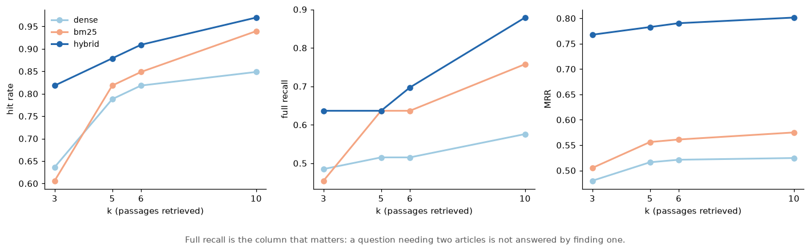
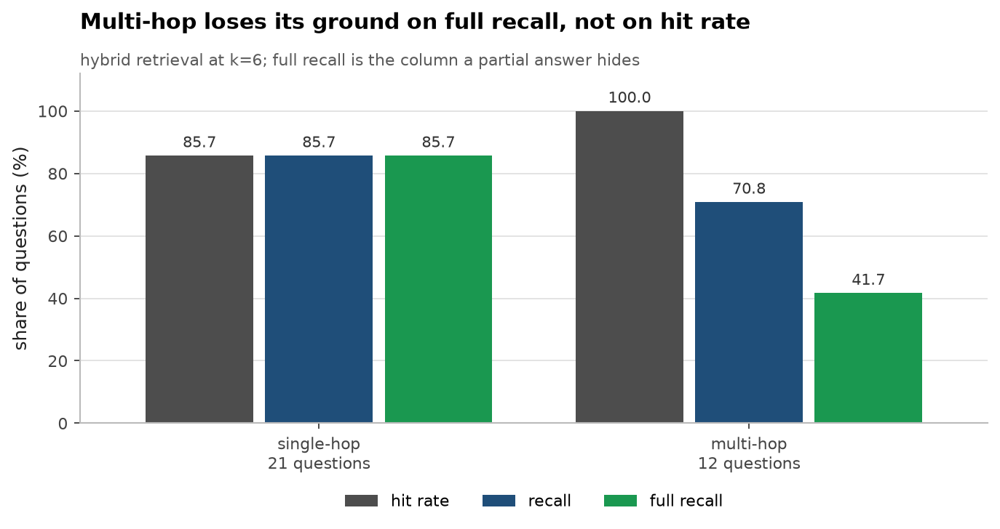
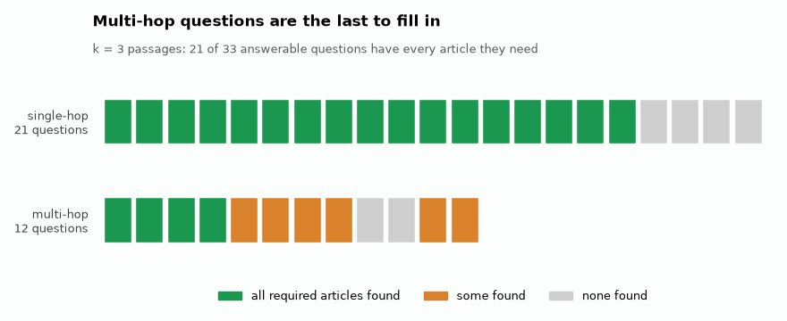
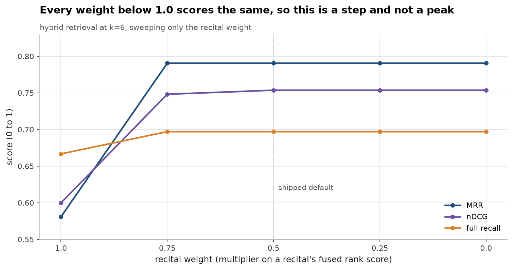
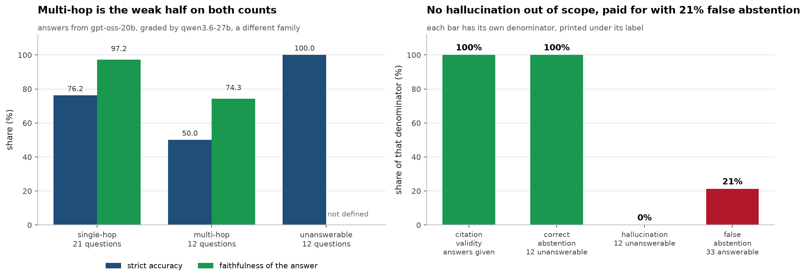
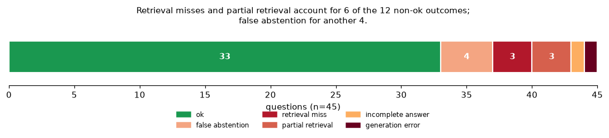

# EU AI Act RAG, with an evaluation I actually ran

**[▶ Live demo](https://eu-ai-act-rag-eval.streamlit.app/)** · every
answer shows the passages it came from.

[](https://github.com/aghasalim/eu-ai-act-rag/actions/workflows/ci.yml)
[](https://github.com/aghasalim/eu-ai-act-rag/actions/workflows/demo.yml)
[](https://github.com/aghasalim/eu-ai-act-rag/actions/workflows/publish-image.yml)
[](https://www.python.org/)
[](LICENSE)
[](https://doi.org/10.5281/zenodo.23003624)

A question-answering system over **Regulation (EU) 2024/1689 (the EU AI Act)**,
as amended by Regulation (EU) 2026/1744 (the "Digital Omnibus on AI"). The corpus is
versioned by the date of the text: `2026-07-27` (the consolidated text, the default)
and `2024-07-12` (the original Official Journal text, kept so the two can be compared).
Most RAG projects, mine included,
stop at "look, it answers questions" without checking whether the answer is in the
documents retrieved. Here the measurement is the main part and the chatbot is the side
effect: 45 hand-written questions, the system scored against them, the failures written
down. The retrieval is decent (90.9% of questions get at least one
correct provision) and genuinely bad at one specific thing (questions that need two
articles at once, only 41.7% of those get everything they need). I'd rather show you
that number than hide it. Every figure here is recomputed from the per-question
records by independent implementations in `verify/`, and CI fails if any of them
disagree.

Long write-up: **[notes/METHODS.md](notes/METHODS.md)**. Per-question numbers:
**[RESULTS.md](RESULTS.md)**.

---

## Retrieval



45 hand-written questions over 464 chunks. BM25 leads dense on full recall at every k,
and the fusion is what buys the gap over both. That last gap is two questions out of 33
and does not survive a paired test, which I only found out by
[recomputing it](#every-number-here-is-recomputed-in-another-language). Retrieval
scoring needs no LLM, so these numbers are free to reproduce.

### Retrieval, k=6

<!-- RETRIEVAL_TABLE:START -->
| strategy | hit rate | recall | full recall | MRR | nDCG | s/query |
|---|---|---|---|---|---|---|
| dense (bge-small) | 81.8% | 67.2% | 51.5% | 0.521 | 0.537 | 0.369 |
| BM25 | 84.9% | 73.2% | 63.6% | 0.561 | 0.571 | 0.002 |
| **hybrid (RRF)** | **90.9%** | **80.3%** | **69.7%** | **0.795** | **0.756** | 0.019 |
<!-- RETRIEVAL_TABLE:END -->

"Hit rate" means at least one required article showed up. "Full recall" means *all* of
them did, and that is the column I care about.



Multi-hop questions lose their ground on full recall: hybrid finds something relevant
for 100% of them and everything they need for 41.7%. Keyword search beating embeddings
was the other surprise, both broken down in
[notes/METHODS.md](notes/METHODS.md#three-things-i-did-not-expect).



*Each tile is one of the 33 answerable questions, coloured by how much of what
it needs hybrid retrieval has found. Only k changes across the frames, 3 then
5 then 6 then 10, and the tiles that never fill in are the multi-hop ones.*



Recitals, the non-binding "whereas" paragraphs, restate the rules in flowing prose and
were crowding binding articles out of the top-k. Down-weighting them moved MRR from
0.601 to 0.795. Below 1.0 the weights barely differ: MRR and full recall are identical
across them and nDCG only creeps from 0.751 to 0.756. So it is a step, not a peak fitted
to 45 questions.

## Answers

Answered by `openai/gpt-oss-20b`, graded by `qwen/qwen3.6-27b`, a different model
family, so it isn't marking its own work. **All 45 questions.**

| metric | value |
|---|---|
| **Faithfulness** (claims entailed by retrieved text) | **90.2%** |
| **Citation validity** (citations pointing at retrieved passages) | **100%** |
| **Correct abstention** on out-of-scope questions | **100%** (12/12) |
| **Hallucination rate** on out-of-scope questions | **0%** |
| Answer accuracy, strict | 66.7% |
| Answer accuracy, incl. partially correct | 69.7% |
| False abstention (refused a question it could answer) | 21.2% |



12 out of 12 out-of-scope questions refused, none hallucinated, including ones designed
to bait it. It errs toward refusing, which is why false abstention is 21%. Per-type
breakdown, and the `LLM_MAX_TOKENS` bug that was costing 12 points of accuracy, in
[notes/METHODS.md](notes/METHODS.md#answer-quality-broken-out).



Six of the twelve non-ok outcomes are retrieval failures, three complete misses and
three partial, and four more are refusals of answerable questions. Only two are
generation faults given correct evidence, which is the argument for spending effort on retrieval.

## The law changed under it

I built and measured this on the 2024 text. On 27 July 2026 the Omnibus moved the
high-risk dates (Annex III to 2 December 2027, Annex I to 2 August 2028), added two
Article 5 prohibitions, replaced Article 4 and added Articles 4a and 60a, among
others. So I wrote 11 more questions that only the amended text can answer, each
with the exact wording its answer rests on, and ran retrieval on both texts. The
changes I checked, and the quote behind every question, are in
[notes/AMENDMENTS.md](notes/AMENDMENTS.md).

Hybrid retrieval, k=6:

<!-- STALE_TABLE:START -->
| questions | text searched | answerable | hit rate | full recall | MRR | current wording in top k |
|---|---|---|---|---|---|---|
| original | 2024-07-12 | 33 | 90.9% | 69.7% | 0.795 | n/a |
| original | 2026-07-27 | 33 | 90.9% | 69.7% | 0.785 | n/a |
| amended | 2024-07-12 | 11 | 63.6% | 45.5% | 0.636 | 0.0% |
| amended | 2026-07-27 | 11 | 81.8% | 63.6% | 0.773 | 63.6% |

On the amended questions the 2024 text still finds a provision with the right number for 63.6% of them, and the current wording for 0.0%. On the 2026 text that is 81.8% and 63.6%.
<!-- STALE_TABLE:END -->

This is the failure a stale RAG system hides. Measured the usual way, by whether the
right article number comes back, the old corpus still looks respectable on questions about
the new law, because most amendments rewrite an article without renumbering it. But
not one retrieved chunk holds the current wording, so any answer built on it states
the old rule with a correct-looking citation. Two articles it cannot return at all,
4a and 60a, did not exist in 2024.

Two things I am not hiding. The two plain date questions (a01, a02) miss Article 113
on both texts: the top 6 is all articles about high-risk systems (6, 8, 43 and so on),
none of them the article that holds the dates. That is the same weakness that cost s02
on the original run. And the answer
numbers above were measured on the 2024 text; I have not re-run generation on the
amended one, so there is no answer-level comparison yet, only retrieval.

Three of the original 45 questions are now out of date (m04 superseded, s15 and m12
incomplete). They are marked in `qa_set.jsonl` and left as they were, since they are
right for the text the published numbers were measured on.

## Citing the paragraph, not the article

A legal answer is cited as "Article 6(3)", not "Article 6". So there is now a
second chunking: one chunk per numbered paragraph, or per top-level point where an
article has no numbered paragraphs (Article 3's definitions, Article 113's dates).
Every line is labelled with its place in the outline, so a chunk knows it is
Article 5(1) and holds points (f) to (h). The text is the same; it is only cut
differently: 921 chunks for the 2024 text instead of 464, 994 instead of 498 for 2026.

Each of the 56 questions with an answer now also has gold paragraph references
(`gold_refs`, e.g. `art_5(1)(f)`), and a test checks that every one of them exists
in the corpus. The new metrics treat each retrieved chunk as a citation of what it
is labelled as and compare at paragraph level, so Article 5(1)(f) and 5(1)(h) are
the same paragraph and 6(3) and 6(4) are not. Citation precision is the share of
distinct cited paragraphs that are gold.

Hybrid retrieval, k=6 (`make eval-paragraph`):

| questions | chunks | hit rate | full recall | MRR | paragraph hit | paragraph full recall | paragraph MRR | citation precision |
|---|---|---|---|---|---|---|---|---|
| original, 2024 text | article | 90.9% | 69.7% | 0.790 | 0.0% | 0.0% | 0.000 | 0.000 |
| original, 2024 text | paragraph | 97.0% | 75.8% | 0.843 | 90.9% | 75.8% | 0.757 | 0.176 |
| amended, 2026 text | article | 81.8% | 63.6% | 0.773 | 0.0% | 0.0% | 0.000 | 0.000 |
| amended, 2026 text | paragraph | 81.8% | 63.6% | 0.818 | 81.8% | 54.5% | 0.773 | 0.155 |

The article rows are zero by construction: an article chunk can only be cited as
the whole article, and only one gold reference (s02, the general application date in
Article 113's unnumbered text) is article level, and hybrid misses it.
Citation precision at k=6 has a low ceiling. Most questions have one or two gold
paragraphs and six citations, so a perfect ranker would score 0.232 on the original
set and 0.212 on the amended one. At k=3 it is 0.308 against a ceiling of 0.465.

The surprise was that smaller chunks also helped at article level on the original
questions: full recall went from 69.7% to 75.8%, two more questions. On 33
questions that is not a significant gap, but it did not cost anything either, so
search and the app now use paragraph chunks. The published answer numbers above
were measured on article chunks and `make eval` still reproduces them that way.

## A bigger question set

45 questions was too few to say much, so there are now 67 more in
`eval/qa_extended.jsonl`, written from the 2026 text: 123 in all. Each has gold
article and paragraph references, a short gold answer, and the exact wording the
answer rests on. `make check-qa` (also a test in CI) checks all three files against
the corpus: every gold reference has to exist, every quote has to sit inside a gold
paragraph, and every gold paragraph of the new set has to hold a quote. It also
works out which questions quote wording the 2024 text does not have. 13 of the 67 do.

| topic | questions |
|---|---|
| high-risk classification and obligations | 28 |
| prohibited practices | 7 |
| general-purpose AI models | 7 |
| transparency | 5 |
| penalties | 6 |
| dates and transitional periods | 6 |
| provisions added by the 2026 amendments | 8 |

Hybrid retrieval on the 2026 text, k=6 (`make eval-extended`). "All" is the three
sets together, less m04, which the amendments superseded: 110 questions with an answer.

| questions | chunks | answerable | hit rate | full recall | MRR | paragraph full recall | citation precision |
|---|---|---|---|---|---|---|---|
| new 67 | article | 67 | 95.5% | 89.6% | 0.812 | 0.0% | 0.000 |
| new 67 | paragraph | 67 | 98.5% | 92.5% | 0.865 | 86.6% | 0.171 |
| all | article | 110 | 92.7% | 80.9% | 0.799 | 0.9% | 0.002 |
| all | paragraph | 110 | 96.4% | 83.6% | 0.853 | 79.1% | 0.169 |

The new questions are easier than the original 45, and I think I know why: I wrote
them with the paragraph open, so they reuse its words, which is what BM25 rewards.
The original set was written to be harder and still is. Treat the new numbers as a
regression check for the paragraph chunker and the amended text rather than as
a measure of how the system does on real users' questions. Paragraph chunks were
better than article chunks on all of it, by 2.7 points of full recall on the 110.
The 13 questions that need the amended wording get it in the top 6 for 10 of them with
paragraph chunks and 11 with article chunks.

## Checking the judge

The answer grades above come from an LLM judge, so I graded 41 of the same answers
by hand, from the text of the Act and without looking at the judge's grade. They are
every non-empty answer that did not abstain in two runs of the same generator, with
answers identical across the runs counted once. The labels, with a note on each
mistake, are in `eval/human_labels.jsonl`; I made all of them myself. `make agreement`
compares them with the stored outputs, so it needs no API key.

| what is compared | items | agreement | Cohen's kappa |
|---|---|---|---|
| judge grade, correct / partial / incorrect | 41 | 82.9% | 0.52 |
| judge grade, correct against not correct | 41 | 82.9% | 0.48 |
| abstention rule (`NOT_IN_CORPUS` in the answer) | 45 | 100% | 1.00 |

All 7 disagreements are about "partial". The judge marked 5 answers partial that I
marked correct: four for leaving out a detail of the reference that I did not think
the question needed (s13, s21, m01, m10), one for a sentence cut off after the answer
was already given (s17). It marked
m04 correct twice where I marked it partial: the list of articles is right, but the
answer describes Articles 102 to 109 and 112 wrongly, and the judge only compares
against the reference. So it is strict about omissions and blind to wrong extra
claims. On the published run the disagreements cancel: strict accuracy is 66.7% and
lenient 69.7% under either set of grades. Every answer either of us called incorrect,
both of us did.

The citation parser, which the citation validity number depends on, agrees with my
reading of what each answer cites on 80.5% of answers. It never invents a citation
(precision 100%) but misses 20.4% of them (recall 79.6%). Most misses are citations
outside brackets, "Article 55(c)" in bold or "Article 49(2) requires" in running text;
two are brackets left unclosed by an answer that was cut off. So the citation validity
figure is computed over the bracketed citations only.

What this does not cover: the claim-level faithfulness judge. Checking it needs each
claim read against the retrieved passages, which I have not done. There is no API key
on this machine, so the judge has not been re-run either. `eval/agreement.py --rejudge
MODEL` grades the same 41 answers with a live judge and adds it to the comparison
once a key is in `.env`.

## Method, briefly

Official XHTML from the EU Publications Office Cellar API (CELEX `32024R1689`), chunked on the document's own articles, recitals and annexes, because the answer to a
legal question is a citation: 113 articles + 180 recitals + 13 annexes → **464 chunks**,
all under the encoder's 512-token limit. The amended text (CELEX `02024R1689-20260727`)
comes from the same API in different markup and has no preamble, so the unamended
recitals are carried over: 119 articles + 180 recitals + 14 annexes → 498 chunks. Retrieval is `BAAI/bge-small-en-v1.5` in Chroma
fused with BM25 by Reciprocal Rank Fusion, which ranks by position and so has no scaling
constant to fit. Detail in [notes/METHODS.md](notes/METHODS.md#3-method), test set in
[notes/METHODS.md](notes/METHODS.md#4-the-test-set).

## Running it

```bash
make setup && make corpus && make index
make eval-retrieval
```

Reproduces every retrieval number above. No API key, no LLM calls, no cost.
`make eval-versions` adds the runs on the amended text and the amended questions.
`make eval-paragraph` compares article and paragraph chunks, and `make eval-extended`
runs the 123-question set.

For generated answers, add a free [Groq](https://console.groq.com/keys) key:

```bash
cp .env.example .env && echo "GROQ_API_KEY=your_key_here" >> .env
make eval && make report && make app
```

### As a package

The code installs as `euactrag`, with a command and two functions:

```bash
pip install .            # or: pip install dist/euactrag-0.1.0-py3-none-any.whl
euactrag fetch && euactrag ingest && euactrag index
euactrag search "Is emotion recognition at work prohibited?" -k 3
euactrag ask "What fine applies to a prohibited practice?"    # needs an LLM key
```

```python
import euactrag
hits = euactrag.search("When do the Annex III rules apply?", k=3)
print(hits[0]["citation"], hits[0]["ref"])
```

Outside a checkout the corpus and index go to `~/.cache/euactrag`, or wherever
`EUACTRAG_DATA` points. `make dist` builds the sdist and wheel and checks them, and
CI does the same on every push and installs the wheel on its own. It is not on PyPI.

Or pull the container:

```bash
docker run -p 8501:8501 ghcr.io/aghasalim/eu-ai-act-rag:latest
```

`make docker` builds it locally. Image size and hosting notes in
[notes/METHODS.md](notes/METHODS.md#7-docker).

## Limitations

- **41.7% full recall on multi-hop questions.** Biggest weakness by far.
- **I wrote every question myself** for a system I also built. The headline numbers
  rest on the original 45, and small differences there are noise. The 67 added later
  share wording with the text they were written from, so they flatter retrieval.
- **The answer numbers are for the 2024 text.** Retrieval has been measured on both
  texts; generation only on the original.
- **The consolidated text has no legal effect.** Only the Official Journal texts are
  authentic. I checked every change I rely on against the amending act itself.
- **No questions where a recital is the right answer**, which makes the recital
  down-weighting look better than it probably is.
- **English only.** The Act is equally valid in 24 languages and I've tested one.
- A student project, not legal advice. Please don't make compliance decisions with it.

Full list in [notes/METHODS.md](notes/METHODS.md#5-limitations).

## Repository layout

```
src/euactrag/    fetch → ingest (chunking) → index → retrieve → pipeline
eval/            qa_set.jsonl · qa_amended.jsonl · metrics.py · judge.py · run_eval.py · report.py
app/             Streamlit UI, shows the answer next to its sources
tests/           corpus integrity, metric maths, citation parsing
deploy/          Hugging Face Space template
notes/           METHODS.md, the long-form write-up · AMENDMENTS.md, the 2026 changes
verify/          the same numbers, recomputed independently
```

## Credit

The corpus is Regulation (EU) 2024/1689 from the Official Journal of the European Union,
via the EU Publications Office (CELEX 32024R1689), and its consolidated text as amended
by Regulation (EU) 2026/1744 (CELEX 02024R1689-20260727). Reuse is covered by Decision
2011/833/EU. Nothing here is affiliated with or endorsed by the EU.

The code is MIT ([LICENSE](LICENSE)). The corpus is not mine to licence, so its
attribution lives in [NOTICE](NOTICE).
